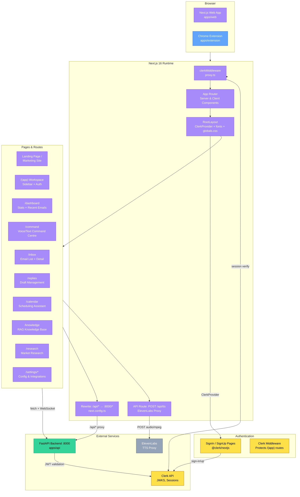
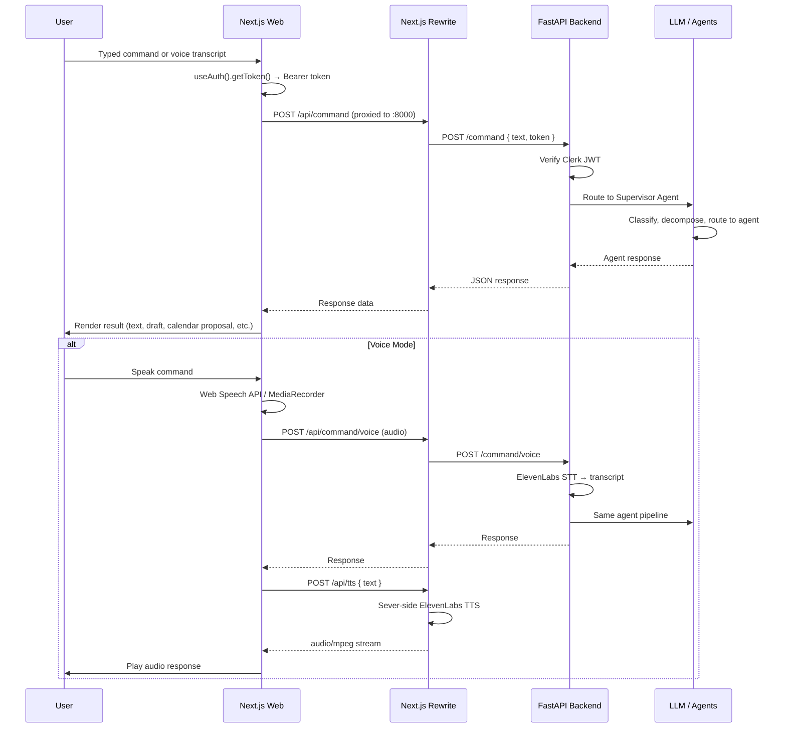
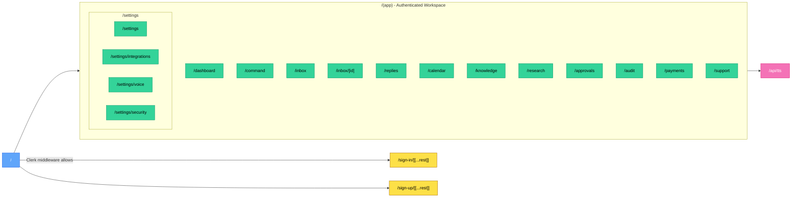
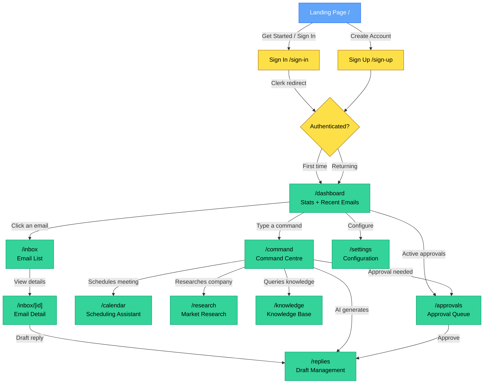
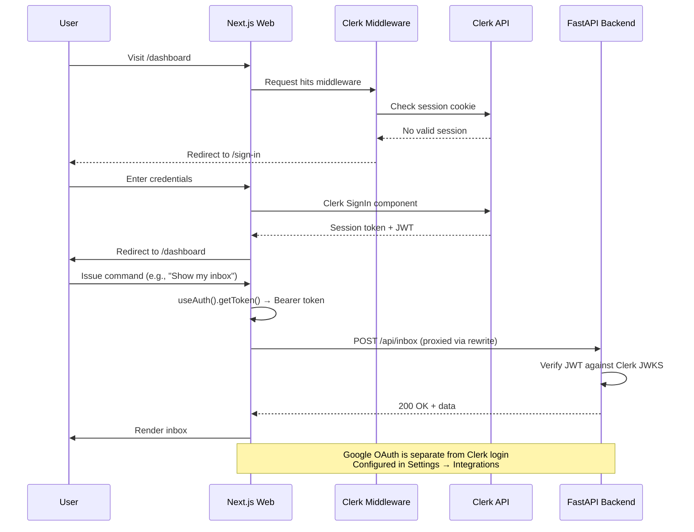
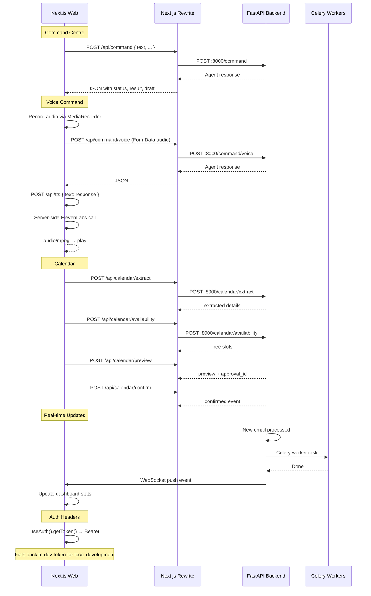

# Aether Web — Multi-Agent AI Executive Assistant Frontend

<p align="center">
  
</p>

<p align="center">
  
  
  
  
  
  
  
</p>

<p align="center">
  The AI-native command centre for your inbox. Voice or text, one unified interface — seven specialised agents, one supervisor.
</p>

> **Part of the Aether monorepo.** Backend lives at [`apps/api`](../api/README.md). Chrome extension at [`apps/extension`](../extension/).

---

## Features

| Capability | Description |
|---|---|
| **Command Centre** | Unified voice/text input surface — routes to the right AI agent via the Supervisor |
| **Inbox Intelligence** | Prioritised, categorised email list with AI summaries, thread context, and natural language search |
| **AI Reply Drafts** | Context-aware drafts grounded in thread history, Knowledge Base, and Playbooks |
| **Calendar Agent** | Natural language scheduling with free/busy availability, ranked candidate slots, and Google Meet links |
| **Knowledge Base (RAG)** | Upload PDFs, DOCX, TXT, MD — semantic search across Company Memory |
| **Market Research** | On-demand company research with SWOT, competitive analysis, and verified source citations |
| **Approval Gate** | Every send, schedule, and pay action gated behind explicit user confirmation — backend-enforced |
| **Voice Interface** | ElevenLabs STT for voice commands and TTS for natural spoken responses |
| **Audit Log** | Complete trail of every agent action with approval metadata |
| **Settings & Integrations** | Google Workspace OAuth connection, voice/tone profile, security controls |

---

## Why This Frontend?

Aether is not a dashboard. It is a **command centre** — the user speaks or types a natural language instruction, and the system routes it to the right specialised agent.

- **Conversation-first** — the primary interaction pattern is a chat with the Supervisor Agent, not navigating menus
- **Approval at the centre** — every consequential action is visually blocked behind a slide-to-approve gate
- **Dark-first design** — built for extended use sessions, reduces eye strain, emphasises AI output with glow/glass effects
- **Workspace layout** — persistent sidebar with collapsible navigation, consistent across all authenticated pages

---

## Technology Stack

### Framework & Runtime

| Technology | Purpose |
|---|---|
| **Next.js 16** (App Router) | React framework with server components, streaming, and rewrites |
| **React 19** | UI library with server components and concurrent features |
| **TypeScript** | Type safety across the entire codebase |

### Styling & UI

| Technology | Purpose |
|---|---|
| **Tailwind CSS 4** | Utility-first CSS with `@theme` tokens and custom variants |
| **shadcn/ui** (base-nova style) | Accessible, unstyled UI primitives (Button, Card, Badge, Input, Table, Switch, Sidebar) |
| **@base-ui/react** | Headless, accessible component primitives (used by Button) |
| **Framer Motion 12** | Declarative animations, gestures, layout animations |
| **Lucide React** | Consistent icon library |
| **Recharts** | Charts (dashboard stats) |
| **tw-animate-css** | Tailwind-compatible animation utilities |
| **twMerge + clsx** | Class name merging (via `cn()` utility) |

### State & Data

| Technology | Purpose |
|---|---|
| **TanStack React Query 5** | Server state management, caching, revalidation |
| **Zustand 5** | Lightweight client state management |
| **React Hook Form** | Performant form state management |
| **Zod 4** | Schema validation |

### Authentication

| Technology | Purpose |
|---|---|
| **Clerk** | User identity, session management, JWT, social login |
| **@clerk/nextjs** | Clerk SDK for Next.js with `middleware`, `auth()`, `useAuth()`, `useUser()` |

### API & Communication

| Technology | Purpose |
|---|---|
| **Next.js Rewrites** | `/api/*` proxied to FastAPI backend (`next.config.ts`) |
| **WebSocket** | Real-time dashboard updates (`/ws`) |
| **Fetch API** | Direct REST calls to backend with Bearer token auth |

### Integrations

| Technology | Purpose |
|---|---|
| **ElevenLabs** | Voice STT (Web Speech API + ElevenLabs) and TTS (server-side proxy via `/api/tts`) |
| **Google Workspace** | OAuth-based Gmail/Calendar/Meet API access (connected via Settings) |

### Development

| Technology | Purpose |
|---|---|
| **ESLint 9** + `eslint-config-next` | Linting with Next.js core-web-vitals and TypeScript rules |
| **Prettier** | Code formatting (monorepo-wide) |
| **pnpm** | Package manager with workspace support |
| **Turborepo** | Monorepo build orchestration |

---

## Architecture Overview



### Request Lifecycle



---

## Folder Structure

```
apps/web/
├── .clerk/                          # Clerk local configuration
├── app/                             # Next.js App Router pages
│   ├── (app)/                       # Authenticated workspace (route group)
│   │   ├── layout.tsx               # App shell: SidebarProvider + auth.protect()
│   │   ├── approvals/page.tsx       # Unified approval queue (mock data)
│   │   ├── audit/page.tsx           # Audit log table (mock data)
│   │   ├── calendar/page.tsx        # Calendar agent (live API: extract, availability, preview, confirm)
│   │   ├── command/page.tsx         # Command centre (live API: voice/text, drafts, calendar proposals)
│   │   ├── dashboard/page.tsx       # Dashboard summary (live API + mock data)
│   │   ├── inbox/
│   │   │   ├── page.tsx             # Inbox list (live API: fetch, search)
│   │   │   └── [id]/page.tsx        # Email detail (async server component + mock data)
│   │   ├── knowledge/page.tsx       # Knowledge Base RAG (mock data)
│   │   ├── payments/page.tsx        # Payment agent scaffold (mock data)
│   │   ├── replies/page.tsx         # Draft management (live API: generate, edit, approve, send)
│   │   ├── research/page.tsx        # Market research (live API: run, result, disambiguation)
│   │   ├── settings/
│   │   │   ├── layout.tsx           # Tab navigation: General, Integrations, Voice, Security
│   │   │   ├── page.tsx             # General settings (profile, auto-pipeline toggles)
│   │   │   ├── integrations/page.tsx # Google OAuth management (live API: status, connect, disconnect)
│   │   │   ├── security/page.tsx    # Approval gates, session, danger zone
│   │   │   └── voice/page.tsx       # ElevenLabs voice ID, tone profile
│   │   └── support/page.tsx         # Support ticket table (mock data)
│   ├── api/
│   │   ├── auth/session/            # (empty — scaffolded)
│   │   └── tts/route.ts             # POST /api/tts — ElevenLabs TTS proxy
│   ├── auth/callback/               # (empty — scaffolded)
│   ├── sign-in/
│   │   ├── layout.tsx               # Sign-in layout (passthrough)
│   │   └── [[...rest]]/page.tsx     # Clerk SignIn component
│   ├── sign-up/
│   │   ├── layout.tsx               # Sign-up layout (passthrough)
│   │   └── [[...rest]]/page.tsx     # Clerk SignUp component
│   ├── favicon.ico
│   ├── layout.tsx                   # Root layout: ClerkProvider, fonts, globals.css, CustomCursor
│   └── page.tsx                     # Landing page (marketing site)
│
├── components/
│   ├── landing/                     # Landing page section components
│   │   ├── AgentMap.tsx             # Agent orchestration visualisation (Framer Motion)
│   │   ├── ApprovalGate.tsx         # Slide-to-approve interactive demo
│   │   ├── CommandCentre.tsx        # Three-panel command centre preview
│   │   ├── FAQ.tsx                  # FAQ accordion
│   │   ├── FeaturesBento.tsx        # Feature grid with bento layout
│   │   ├── FinalCTA.tsx             # Call-to-action section
│   │   ├── Footer.tsx               # Site footer with links
│   │   ├── GhostNav.tsx             # Transparent navigation bar
│   │   ├── GrainBackground.tsx      # Noise grain overlay texture
│   │   ├── Hero.tsx                 # Hero with typewriter effect + CTA
│   │   ├── IntelligenceOrb.tsx      # Animated particle sphere
│   │   ├── Pricing.tsx              # Pricing grid
│   │   ├── Problem.tsx              # Problem/solution section
│   │   ├── Stats.tsx                # Usage statistics counter
│   │   ├── TriageBento.tsx          # Auto-triage feature showcase
│   │   ├── VoiceSection.tsx         # Voice interface demo
│   │   └── Workflow.tsx             # User workflow timeline
│   │
│   ├── layout/                      # Workspace layout components
│   │   └── app-sidebar.tsx          # Collapsible sidebar navigation
│   │
│   └── ui/                          # shadcn/ui primitives
│       ├── badge.tsx                # Badge with cva variants
│       ├── button.tsx               # Button (powered by @base-ui/react)
│       ├── card.tsx                 # Card container
│       ├── CustomCursor.tsx         # Animated custom cursor (Framer Motion spring)
│       ├── input.tsx                # Text input
│       ├── label.tsx                # Form label
│       ├── sidebar.tsx              # Sidebar system (context, provider, trigger, menu)
│       ├── switch.tsx               # Toggle switch
│       ├── table.tsx                # Accessible table
│       └── textarea.tsx             # Multi-line text input
│
├── lib/                             # Shared utilities
│   ├── api/
│   │   └── research.ts             # Research API client (run, result)
│   ├── types/
│   │   └── research.ts             # TypeScript types, guards, SWOT parser
│   ├── mock-data.ts                 # Mock data for emails, drafts, payments, approvals, etc.
│   └── utils.ts                     # cn() classname utility (clsx + twMerge)
│
├── styles/
│   └── globals.css                  # Tailwind 4 imports, @theme tokens, custom utilities, animations
│
├── public/                          # Static assets
│   ├── logo.svg, logo.png, logoAether.png
│   ├── favicon / Vercel / window icons
│
├── proxy.ts                         # Clerk middleware — protects all routes except landing + auth
├── next.config.ts                   # Rewrites: /api/* → FastAPI backend, /api/tts → local route
├── postcss.config.mjs               # @tailwindcss/postcss plugin
├── tsconfig.json                    # Path alias @/* → ./
├── eslint.config.mjs                # ESLint 9 with Next.js core-web-vitals + TypeScript
├── components.json                  # shadcn/ui configuration
├── .env.example                     # Environment variable template
└── package.json                     # Scripts: dev, build, start, lint
```

---

## Routing Structure



| Route Group | Path | Type | Auth | Data Source |
|---|---|---|---|---|
| Public | `/` | Server Component | No (Clerk allows unauthenticated) | Static landing page |
| Auth | `/sign-in/[[...rest]]` | Server Component | No | Clerk `<SignIn>` |
| Auth | `/sign-up/[[...rest]]` | Server Component | No | Clerk `<SignUp>` |
| App | `/dashboard` | Client | `auth.protect()` | Live API + mock |
| App | `/command` | Client | `auth.protect()` | Live API |
| App | `/inbox` | Client | `auth.protect()` | Live API |
| App | `/inbox/[id]` | Server | `auth.protect()` | Mock data |
| App | `/replies` | Client | `auth.protect()` | Live API |
| App | `/calendar` | Client | `auth.protect()` | Live API |
| App | `/knowledge` | Server | `auth.protect()` | Mock data |
| App | `/research` | Client | `auth.protect()` | Live API |
| App | `/approvals` | Server | `auth.protect()` | Mock data |
| App | `/audit` | Server | `auth.protect()` | Mock data |
| App | `/payments` | Server | `auth.protect()` | Mock data |
| App | `/support` | Server | `auth.protect()` | Mock data |
| App | `/settings` | Client | `auth.protect()` | Mixed |
| App | `/settings/integrations` | Client | `auth.protect()` | Live API |
| App | `/settings/security` | Server | `auth.protect()` | Static |
| App | `/settings/voice` | Server | `auth.protect()` | Static |
| API | `/api/tts` | Route Handler | No (server-side) | ElevenLabs |

---

## Design System

### Colours

| Token | Value | Usage |
|---|---|---|
| `--background` | `oklch(0.12 0.008 265)` | Page background |
| `--foreground` | `oklch(0.975 0.003 260)` | Primary text |
| `--primary` | `oklch(0.65 0.25 270)` | CTA, links, active states |
| `--secondary` | `oklch(0.28 0.035 265)` | Secondary elements |
| `--muted` | `oklch(0.17 0.018 265)` | Subtle surfaces |
| `--destructive` | `oklch(0.65 0.22 25)` | Error, warnings |
| `--accent` | `oklch(0.6 0.18 200)` | Accent highlights |
| `--sidebar` | `oklch(0.18 0.02 265)` | Sidebar background |

### Custom Theme Colours

| Token | Value | Usage |
|---|---|---|
| `--color-cobalt` | `#3b82f6` | Primary blue glow |
| `--color-cobalt-light` | `#60a5fa` | Lighter blue accent |
| `--color-stellar` | `#f9fafb` | Bright text |
| `--color-mercury` | `#9ca3af` | Muted text |
| `--color-obsidian` | `#050505` | Deepest background |
| `--color-emerald-gate` | `#10b981` | Approval gate green |
| `--color-brass` | `#d4af37` | Gold accent |

### Typography

| Font Family | Variable | Usage |
|---|---|---|
| **Inter** (Google Fonts) | `--font-inter` | Sans-serif body and headings |
| **JetBrains Mono** (Google Fonts) | `--font-jetbrains-mono` | Monospace code, data, metadata |

### Border Radius

| Token | Value |
|---|---|
| `--radius-sm` | `0.375rem` |
| `--radius-md` | `0.5rem` |
| `--radius-lg` | `0.625rem` |
| `--radius-xl` | `0.875rem` |
| `--radius-2xl` | `1.125rem` |

### Custom Animations

| Name | Keyframes |
|---|---|
| `pulse-glow` | Scale 1 → 1.15, opacity 0.4 → 0.8 |
| `breath` | Scale 1 → 1.08, opacity 0.08 → 0.12 |
| `scan-line` | Top -10% → 110% |
| `data-flow` | `stroke-dashoffset` 0 → -12 |

### Custom Utilities

| Utility | CSS |
|---|---|
| `text-gradient-stellar` | Linear gradient: `#f9fafb` → `#6b7280` with `background-clip: text` |
| `text-gradient-cobalt` | Linear gradient: `#60a5fa` → `#3b82f6` → `#1d4ed8` |
| `glass-panel` | `background: rgba(10,10,11,0.5)` + `backdrop-filter: blur(20px)` |
| `glass-card` | `background: rgba(255,255,255,0.02)` + `backdrop-filter: blur(12px)` |
| `glow-cobalt` | `box-shadow: 0 0 60px -10px rgba(59,130,246,0.2)` |
| `glow-emerald` | `box-shadow: 0 0 60px -10px rgba(16,185,129,0.2)` |

---

## User Flow



---

## Authentication Flow



---

## API Communication



---

## State Management

### TanStack React Query (Server State)

Server state (API responses) is managed via direct `fetch` calls with `useAuth().getToken()` for Bearer token auth — TanStack React Query is listed as a dependency and used for caching patterns across pages.

### Zustand (Client State)

Zustand is listed as a dependency and available for lightweight client state. The command centre page maintains local state via `useState` for:
- Conversation transcripts
- Active draft info
- Calendar proposals
- Research results

### Component-Level State

Most pages use React's built-in `useState` and `useEffect` for data fetching and UI state. The Command Centre is the most stateful page, maintaining:
- `transcript: CommandTranscript[]` — conversation history
- `activeDraft: ActiveDraftInfo | null` — current draft being edited
- `activeCalendarProposal: ActiveCalendarProposalInfo | null` — calendar proposal awaiting approval
- Recording/transcription state for voice mode

---

## Forms & Validation

Forms are built with native HTML elements styled via Tailwind/shadcn:

| Pattern | Location |
|---|---|
| `react-hook-form` + `Zod` | Available (dependencies) for complex forms |
| Native `<form>` + `useState` | Settings pages, calendar search |
| `<form>` + `onSubmit` | Inbox search, knowledge query |
| Controlled inputs | Calendar title/participants editing |

---

## AI Features

### Command Centre (`/command`)

The core AI interface — a unified chat surface where users interact with the Supervisor Agent:

- **Text mode** — type a command, send to `/api/command`
- **Voice mode** — click to record (MediaRecorder + Web Speech API), send to `/api/command/voice`
- **TTS responses** — responses converted to speech via server-side ElevenLabs proxy (`/api/tts`)
- **Draft management** — replies generated in-line displayed in editable cards with approve/edit/delete
- **Calendar proposals** — meeting previews rendered as cards with approve/discard buttons
- **Context resolution** — conversation history maintained in `transcript` array across turns

### Calendar Agent (`/calendar`)

Full scheduling pipeline:

1. **Extract** — natural language → structured meeting details (`POST /calendar/extract`)
2. **Availability** — check free slots across participants (`POST /calendar/availability`)
3. **Preview** — create proposal with Meet link (`POST /calendar/preview`)
4. **Confirm** — approve and create calendar event (`POST /calendar/confirm`)
5. **Double-booking detection** — warns on overlapping proposals

### Research Agent (`/research`)

Market research with disambiguation support:

- **Run research** — `POST /research/run` with company name
- **Disambiguation** — if company name is ambiguous, shows options to clarify
- **Structured report** — executive summary, overview, SWOT, competitors, news, opportunities, risks
- **Source references** — per-claim timestamps and URLs extracted from report text
- **Caching** — results cached in Qdrant with TTL

### Reply Agent (`/replies`)

Draft management with approval gating:

- **Live drafts** — fetched from `GET /replies/drafts`
- **Generate** — `POST /replies/drafts` with email context
- **Edit** — `POST /replies/drafts/{id}/edit` with natural language instructions
- **Prepare send** — creates approval record (`POST /replies/drafts/{id}/prepare-send`)
- **Confirm send** — executes after approval (`POST /replies/drafts/{id}/send`)

---

## Performance Optimisations

| Technique | Usage |
|---|---|
| **Next.js Rewrites** | `/api/*` proxied to backend — no CORS overhead, reduced client-side logic |
| **Server Components** | `/approvals`, `/audit`, `/payments`, `/support`, `/knowledge`, `/inbox/[id]` — pure server-rendered with mock data |
| **Client Components** | Pages needing interactivity (`"use client"`) — `/command`, `/calendar`, `/replies`, `/dashboard`, `/research` |
| **Local state caching** | Calendar and reply pages cache API responses in `localStorage` for offline resilience |
| **Background refetch** | Calendar polls `/calendar/meetings` every 4s + on window focus |
| **Sentry monitoring** | Error tracking via `NEXT_PUBLIC_SENTRY_DSN` |
| **Font optimisation** | `next/font/google` with `variable` fonts — no render-blocking |
| **Image optimisation** | Static assets served from `/public`, Next.js Image component available |
| **Custom scrollbar** | Thin, dark scrollbar to match design system |
| **Custom cursor** | Framer Motion spring physics — only activates on `hover: hover` devices |

---

## Accessibility

| Feature | Implementation |
|---|---|
| **ARIA labels** | Switch uses `role="switch"` + `aria-checked` |
| **Focus management** | Input fields, buttons, links all have visible focus rings (`focus-visible:ring-ring`) |
| **Keyboard navigation** | All interactive elements are keyboard-accessible |
| **Reduced motion** | Framer Motion respects `prefers-reduced-motion` via `useReducedMotion` (available) |
| **Screen reader support** | shadcn/ui primitives inherit Base UI accessibility |
| **Semantic HTML** | `<main>`, `<nav>`, `<aside>`, `<header>`, `<table>` used appropriately |

---

## Responsive Design

| Breakpoint | Behaviour |
|---|---|
| **Desktop (≥1024px)** | Full sidebar + main content, command centre 3-column |
| **Tablet (768–1023px)** | Collapsible sidebar, 2-column grids |
| **Mobile (<768px)** | Sidebar collapsed by default, single-column layouts, bottom sheet navigation |

---

## SEO

| Aspect | Implementation |
|---|---|
| **Metadata** | `layout.tsx` exports `metadata: Metadata` with title and Open Graph tags |
| **Title** | "Aether — The AI Chief of Staff for Your Inbox" |
| **Description** | "The first AI Chief of Staff that watches, triages, and prepares — but only acts on your command." |
| **Open Graph** | Title + description for social preview |
| **Favicon** | `favicon.ico` in root |
| **Robots** | Default (Next.js allows indexing in production) |

---

## Environment Variables

| Variable | Required | Description |
|---|---|---|
| `NEXT_PUBLIC_API_URL` | No | Backend API URL (default: `http://localhost:8000`). Used for API calls and Next.js rewrites |
| `NEXT_PUBLIC_CLERK_PUBLISHABLE_KEY` | Yes | Clerk publishable key (starts with `pk_test_` or `pk_live_`) |
| `NEXT_PUBLIC_CLERK_AFTER_SIGN_IN_URL` | No | Redirect after sign-in (default: `/dashboard`) |
| `NEXT_PUBLIC_CLERK_AFTER_SIGN_UP_URL` | No | Redirect after sign-up (default: `/dashboard`) |
| `CLERK_SECRET_KEY` | Yes | Clerk secret key (starts with `sk_test_` or `sk_live_`). Server-side only |
| `ELEVENLABS_API_KEY` | No | ElevenLabs API key for server-side TTS proxy |
| `ELEVENLABS_VOICE_ID` | No | Voice ID (default: `TRnaQb7q41oL7sV0w6Bu`) |
| `ELEVENLABS_TTS_MODEL` | No | TTS model ID (default: `eleven_flash_v2_5`) |

> Copy `.env.example` to `.env.local` and fill in the values. Only `NEXT_PUBLIC_CLERK_PUBLISHABLE_KEY` and `CLERK_SECRET_KEY` are required for the app to function.

---

## Installation

### Prerequisites

- Node.js 20+
- pnpm 9+
- A [Clerk](https://clerk.com) account and application
- (Optional) ElevenLabs API key for TTS features
- Backend running at `http://localhost:8000` (see [`apps/api/README.md`](../api/README.md))

### Setup

```bash
# Navigate to web app
cd apps/web

# Copy environment template
cp .env.example .env.local

# Edit .env.local with your Clerk keys
# NEXT_PUBLIC_CLERK_PUBLISHABLE_KEY=pk_test_...
# CLERK_SECRET_KEY=sk_test_...

# Install dependencies (from monorepo root)
pnpm install
```

### Start Development

```bash
pnpm dev
# Starts on http://localhost:3000
```

---

## Available Scripts

| Script | Description |
|---|---|
| `pnpm dev` | Start Next.js development server on `:3000` |
| `pnpm build` | Production build |
| `pnpm start` | Start production server |
| `pnpm lint` | Run ESLint on all files |

---

## Error Handling

| Layer | Strategy |
|---|---|
| **API Routes** | `/api/*` proxied to backend — backend errors returned as JSON `{ error: { code, message, ... } }` |
| **TTS Route** | `POST /api/tts` returns 400 for missing text, 502 for ElevenLabs failures |
| **Client Fetch** | Pages check `res.ok` and throw descriptive errors from `res.json().detail` |
| **UI Feedback** | Error states rendered as inline cards with destructive badge styling |
| **Console** | All errors logged with `console.error` |
| **Sentry** | Error monitoring via `NEXT_PUBLIC_SENTRY_DSN` (optional) |

---

## Testing

Tests are not yet configured for the frontend. The project structure is ready for:

```bash
# Future test commands:
pnpm test          # Unit tests (Vitest)
pnpm test:e2e      # E2E tests (Playwright / Cypress)
```

---

## Browser Support

| Browser | Support |
|---|---|
| Chrome 120+ | Full support (also Chrome Extension) |
| Firefox 121+ | Full support |
| Safari 17+ | Full support |
| Edge 120+ | Full support |

Custom cursor only activates on `hover: hover` devices (desktops with a mouse).

---

## Contributing

1. Create a feature branch: `git checkout -b feature/amazing-feature`
2. Make changes following existing code patterns
3. Run `pnpm lint` to check for issues
4. Commit with a descriptive message
5. Open a Pull Request against the main repository

### Code Conventions

- **Imports:** Use `@/` path alias (e.g., `@/components/ui/button`)
- **Components:** Default exports for pages, named exports for shared components
- **Styling:** Tailwind CSS with `cn()` utility for conditional classes
- **State:** `"use client"` for interactive pages, server components for static pages
- **Auth:** `auth.protect()` from `@clerk/nextjs/server` in app layout
- **API calls:** Bearer token from `useAuth().getToken()`

---

## License

This project is part of the Aether monorepo. See the root LICENSE file for details.

---

<p align="center">
  Built with Next.js, React, Tailwind CSS, and shadcn/ui<br/>
  Powered by FastAPI, LangGraph, and Clerk
</p>
